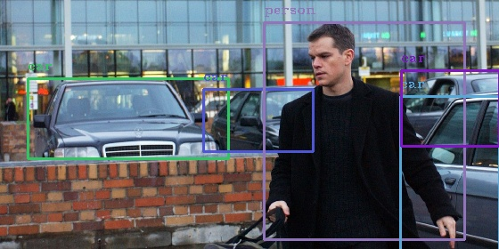
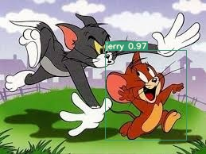

# Session 13 - Object Detection with YOLO v3

## Part 1 - YOLO v3 with OpenCV

Detecting objects in an image where there is a person and an object present in the image.  
_Note_: The object should be present in the COCO classes.

### Result

  

## Part 2 - YOLO v3 with PyTorch

Object detection with Yolo v3 using transfer learning on a class that doesn't belong to COCO dataset.

Class selected: **Jerry**

### Result

Click on the video below to play  

### Parameters and Hyperparameters

- Number of images: 80
- Batch size: 10
- Epochs: 300

### Dataset Preparation

Tom and Jerry dataset

### Results

After running the algorithm for 300 epochs, the result is pretty amazing!

  

## Group Members

- Sainadh
- Sivavamsi

