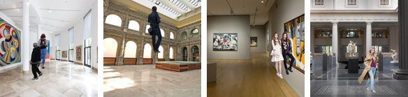
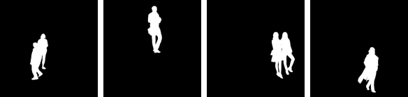
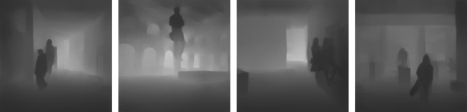

# Sesson 15 - Image Segmentation and Depth Estimation

In Image Segmentation, the machine has to partition the image into different segments, each of them representing a different entity. In the example below you can see how my model separated the image on the left into segments (image on the right).

  
  

In Depth Estimation, the machine has to extract the depth information of the foreground entities from a single image. In the example below you can see how our well my model can extract the depth information (on the right) from an image (on the left).

  
  

- [Model Architecture](docs/architecture.md)
- [Dataset](docs/dataset.md)
- [Deciding Loss Function](docs/deciding_loss_function.md)
  - [Mask Prediction](docs/deciding_loss_function.md#mask-prediction)
  - [Depth and Segmentation Prediction](docs/deciding_loss_function.md#depth-and-segmentation-prediction)
- [Training](docs/training.md)
  - [RMSE + (BCE & Dice)](docs/training.md#rmse--bce--dice)
  - [SSIM + Dice](docs/training.md#ssim--dice)
  - [LR Range Test](docs/training.md#lr-range-test)
  - [RMSE + (BCE & Dice) with New LR and No Augmentation](docs/training.md#rmse--bce--dice-with-new-lr-and-no-augmentation)
- [Project Setup](docs/project_setup.md)
